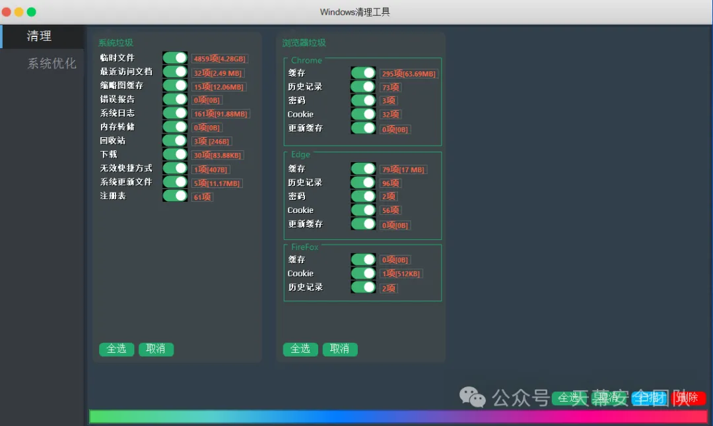
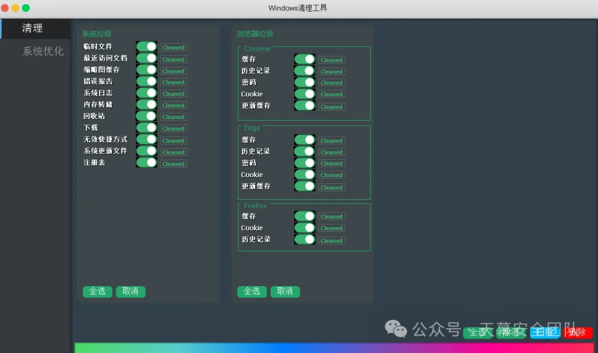

# WindowsCleanUP
由于公司的电脑配置属实拉跨，而各种乱七八糟的清理工具都不开源，要么安装了就给塞个全家桶，所以我自己写一个吧，暂时只实现了清理功能，系统优化功能后面再加，大概如下图：

清理结果：

## 使用方法：

先选中你想清理的项，然后点击扫描，之后点击删除就可以了，如果扫描出来的结果并不想删除，可以关闭对应的项然后点击删除即可，无需重新扫描

## 软件许可协议

1. 本协议授予所有人（以下简称“许可方”）使用本软件（以下简称“软件”）的非独占、不可转让的许可。许可方可以在其内部业务流程中使用软件，但不得将软件用于任何商业目的或与任何第三方共享。 
2.  **使用限制** 许可方不得： 
   * 将软件或其任何部分用于任何非法目的； 
   * 将软件或其任何部分进行再发布、出租、租赁或出借； 
   * 在未经版权持有者明确书面同意的情况下，修改软件后进行再发布。 
3. **版权声明** 软件及其所有副本的版权归版权持有者所有。版权持有者保留所有未明确授予的权利。 
4. **终止许可** 如许可方违反本协议的任何条款，本协议将自动终止，许可方必须立即停止使用软件并销毁所有软件副本。 
5. **有限责任** 软件按“现状”提供，版权持有者不提供任何形式的明示或暗示保证，包括但不限于适销性、特定用途适用性和不侵权的保证。在任何情况下，版权持有者都不对因使用或无法使用软件而产生的任何直接、间接、偶然、特殊或后果性损害负责。 
6. **法律和司法管辖** 本协议受版权持有者所在国家法律管辖，并按照该国法律解释。任何关于本协议的争议应提交版权持有者所在地的法院解决。
7. **完整协议** 本协议构成双方关于软件使用许可的全部协议，取代所有先前的口头或书面协议。
8. **系统稳定性警告** 许可方承认并同意，软件可能包含缺陷，使用软件可能不会导致任何特定结果，且软件的使用可能会影响系统的稳定性。版权持有者不对软件可能导致的任何系统不稳定、数据丢失或任何其他损害承担责任。许可方在使用软件前应自行评估软件对系统的影响，并采取适当的预防措施。许可方应自行承担使用软件的风险。

